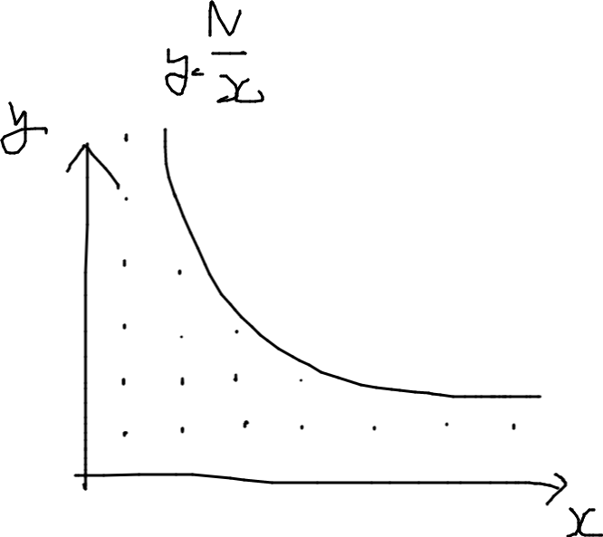
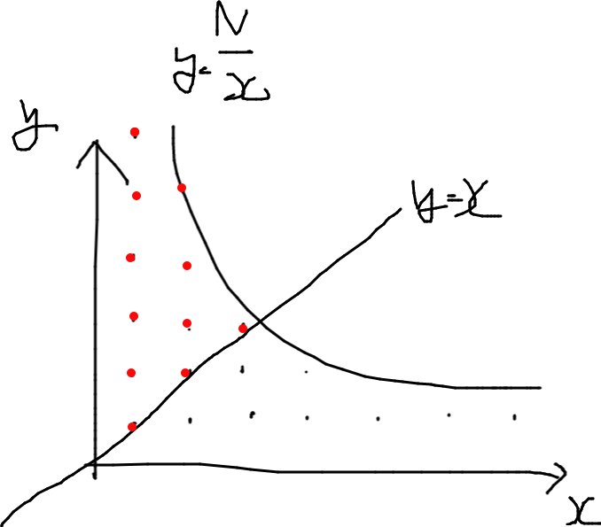
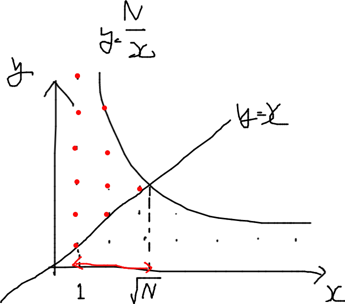
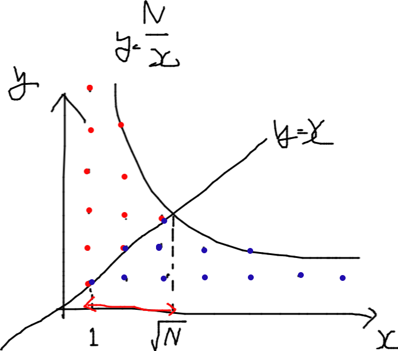

https://atcoder.jp/contests/abc230/tasks/abc230_e
緑下位．整数問題


実は$y\le \frac{N}{x} \space(x>0,y>0)$の格子点の数を問われている．


上図は$y=x$で対称なので，$y\ge x$となる部分の格子点の個数を求めて2倍してやればよい．

このとき$y=x$と$y=\frac{N}{x}$の交点の座標は$x=\sqrt{n}$であり，$x(1\le x \le\sqrt{n})$の範囲の格子点を数え上げればよいことになる．

$y\le\frac{N}{x}$と$y\ge x$に囲まれた部分の格子点の個数は，$\left\lbrack{\frac{N}{x}}\right\rbrack - (x - 1)$で求まるので，$1\le x \le\sqrt{n}$について計算し足し合わせる．

```python
grid = 0
for x in range(1, int(N**0.5) + 1):
    grid += N // x - (x - 1)
```



前述の通り$y=x$で線対称なので値を2倍し，重複して数えられた$y=x$上の格子点を除けば答えとなる．

```python
N = int(input())

grid = 0
for x in range(1, int(N**0.5) + 1):
    grid += N // x - (x - 1)

print(grid * 2 - int(N**0.5))
```

#ABC #E #整数
