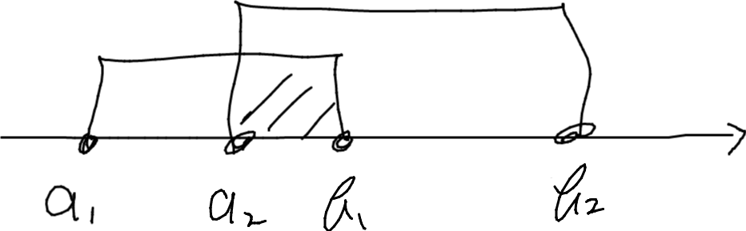
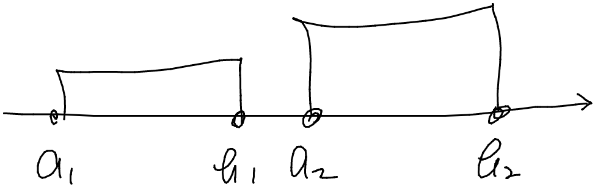
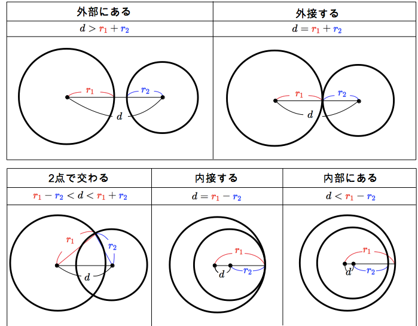

[[https://gyazo.com/6c4e53bb3465d9ddf45ab1bf696385f2.png]]
## 約数列挙

```python
def make_divisors(n):
    divisors = []
    for i in range(1, int(n**0.5) + 1):
        if n % i == 0:
            divisors.append(i)
            if i != n // i:
                divisors.append(n // i)
    divisors.sort()
    return divisors
```

https://qiita.com/LorseKudos/items/9eb560494862c8b4eb56
[[https://gyazo.com/6c4e53bb3465d9ddf45ab1bf696385f2.png]]
[[https://gyazo.com/6c4e53bb3465d9ddf45ab1bf696385f2.png]]
## 拡張互除法(最大公約数)

```python
def extgcd(a, b):
    if b:
        d, y, x = extgcd(b, a % b)
        y -= (a // b) * x
        return d, x, y
    return a, 1, 0
```

https://tjkendev.github.io/procon-library/python/math/gcd.html

最小公倍数は$a*b/gcd(a,b)$で
[[https://gyazo.com/6c4e53bb3465d9ddf45ab1bf696385f2.png]]
## 互除法(最大公約数)

```python
def gcd(x, y):
    if y == 0:
        return x
    else:
        return gcd(y, x % y)
```

https://paiza.hatenablog.com/entry/2020/07/09/最大公約数を求めるアルゴリズム%E3%80%8Cユークリッド
[[https://gyazo.com/6c4e53bb3465d9ddf45ab1bf696385f2.png]]
## 高速素因数分解

```python
def factorization(n):
    arr = []
    temp = n
    for i in range(2, int(-(-(n**0.5) // 1)) + 1):
        if temp % i == 0:
            cnt = 0
            while temp % i == 0:
                cnt += 1
                temp //= i
            arr.append([i, cnt])

    if temp != 1:
        arr.append([temp, 1])

    if arr == []:
        arr.append([n, 1])

    return arr
```

https://qiita.com/snow67675476/items/e87ddb9285e27ea555f8
[[https://gyazo.com/6c4e53bb3465d9ddf45ab1bf696385f2.png]]
## Mod nCr **

```python
def comb(n, r, mod=998244353):
    ret = 1
    if r < n:
        inv = [1]
        for i in range(1, r + 1):
            inv.append(max(1, (-(mod // i) * inv[mod % i]) % mod))
            ret = ret * (n + 1 - i) * inv[i] % mod
    return ret
```

https://qiita.com/atti/items/cb0c015909e48ca326f2
[[https://gyazo.com/6c4e53bb3465d9ddf45ab1bf696385f2.png]]
## 2つの閉区間の重なりを判定する



```python
def check_overlap(a1, b1, a2, b2):
    return max(a1, a2) <= min(b1, b2)
```

[[https://gyazo.com/6c4e53bb3465d9ddf45ab1bf696385f2.png]]
## 閉区間・開区間混合問題に対して

開区間`(a,b)`などは，それぞれ0.1くらい足し引きしてやると，閉区間として扱える．`[a+.1,b-.1]`
[[https://gyazo.com/6c4e53bb3465d9ddf45ab1bf696385f2.png]]
## 円と円の重なり判定


それぞれ，中心$(x_1,y_1)$,$(x_2,y_2)$，半径$r_1, r_2$の円の重なりを判定するには，
中心の距離 >= 半径の和を考えればよい．
[[https://gyazo.com/6c4e53bb3465d9ddf45ab1bf696385f2.png]]
## 180度未満かどうか

```python
def is_convex(a_x, a_y, b_x, b_y, c_x, c_y):
    """
    ##############################
    #C.########.A#################
    ###.######.###################
    ####.####.####################
    #####.##.#####################
    ######..######################
    #######B######################

    ∠ABCが180°未満であるならTrueを，そうでないならFalseを返します．
    """
    return (a_x - b_x) * (c_y - b_y) - (a_y - b_y) * (c_x - b_x) > 0
```

[[https://gyazo.com/6c4e53bb3465d9ddf45ab1bf696385f2.png]]
## 二次元配列を回転させる

```python
def rotate(array):
    return list(zip(*array[::-1]))
```

[[https://gyazo.com/6c4e53bb3465d9ddf45ab1bf696385f2.png]]
## 二次元の図形を左上に寄せる

```python
def move(array):
    while all(e == "." for e in array[0]):
        array = array[1:] + [["." for _ in range(n)]]
    while all(array[i][0] == "." for i in range(n)):
        array = [col[1:] + ["."] for col in array]
    return array
```

ABC218 C - Shapes (https://atcoder.jp/contests/abc218/tasks/abc218_c) で使用．
[[https://gyazo.com/6c4e53bb3465d9ddf45ab1bf696385f2.png]]
## 座標圧縮

```python
def compress(seq):
    dic = {v: i for i, v in enumerate(sorted(set(seq)))}
    return [dic[v] for v in seq]
```

[[https://gyazo.com/6c4e53bb3465d9ddf45ab1bf696385f2.png]]
## エラトステネスの篩

```python
def get_sieve_of_eratosthenes(n: int) -> set:
    """
    Returns the set of prime numbers from 2 to the input value
    :param n: int
    :return: set of prime numbers from 2 to n
    """
    if not isinstance(n, int):
        raise TypeError("n is int type.")
    if n < 2:
        raise ValueError("n is more than 2")
    data: list = list(range(0, n + 1))
    for i in range(2, int(n**0.5) + 1):
        if data[i] > 0:
            for j in range(i**2, n + 1, i):
                data[j] = 0
    return {i for i in range(2, n + 1) if data[i]}
```

[[https://gyazo.com/6c4e53bb3465d9ddf45ab1bf696385f2.png]]
## 銀行丸めではない四捨五入

```python
def normal_round(n):
    return int(n) if float(str(n)[str(n).index(".") :]) < 0.5 else int(n) + 1
```

[[https://gyazo.com/6c4e53bb3465d9ddf45ab1bf696385f2.png]]
## 基数変換

- 10進数 -> n進数
```python
def base10int(value, base):
    if int(value / base):
        return base10int(int(value / base), base) + str(value % base)
    return str(value % base)
```

↑valueが大きい時に丸め誤差が生じる
```python
conv_table = dict(zip(range(16), "0123456789ABCDEF"))


def radix_conversion(n, base):
    if n in (0, 1):
        return n
    max_i = 0
    while n > base**max_i:
        max_i += 1
    ans = ""
    for i in range(max_i)[::-1]:
        a, n = divmod(n, base**i)
        ans += conv_table[a]
    return ans
```

- 10進数 -> 2, 8, 16進数
```python
bin(n), oct(n), hex(n)
```

- n進数 -> 10進数
```python
int(value, n)
```

[[https://gyazo.com/6c4e53bb3465d9ddf45ab1bf696385f2.png]]
## シーケンスの2分割列挙

```python
def classify(data, selectors):
    ret = ([], [])
    for d, s in zip(data, selectors):
        ret[bool(s)].append(d)
    return ret


def dimidiate(array):
    for i in range((1 << len(array)) // 2):
        yield classify(array, map(int, bin(i)[2:].zfill(len(array))))


list(dimidiate([1, 2, 3, 4]))
```

[[https://gyazo.com/6c4e53bb3465d9ddf45ab1bf696385f2.png]]
## 和をandとxorで

$a + b = 2 * (a \& b) + a \oplus b$
