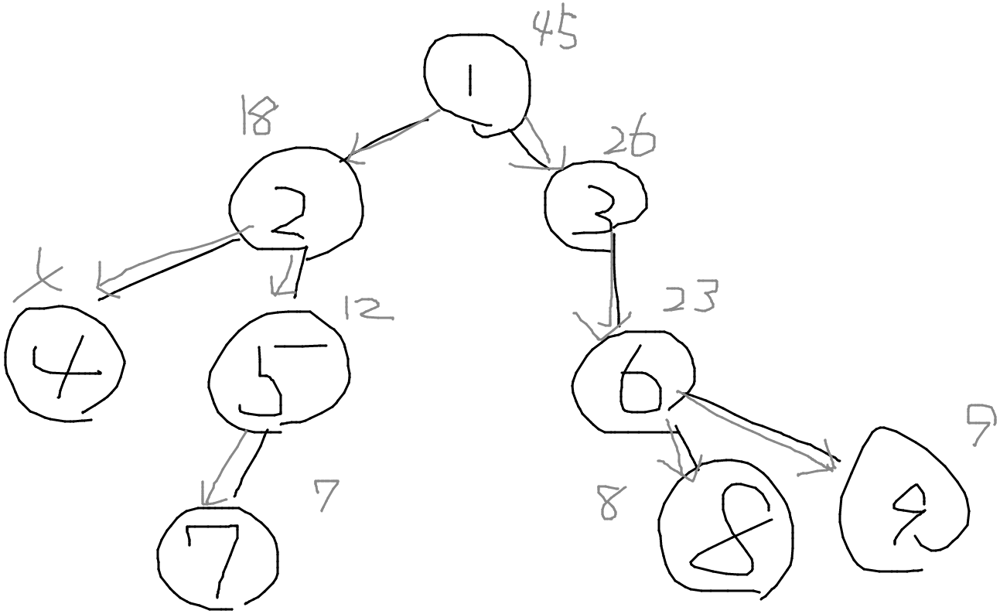

EDPC Vが難しすぎるので，簡単な問題を考えてみる．

$N$頂点の木が存在し，各頂点には$1,...,N$の番号が振られている．$u_i\space(0\le i\le N)$について，$u_i$から辿り着ける頂点に書かれた番号の総和を求めよ．

この問題の解は頂点$u$について，$\sum_{i=1}^{N}i\ -u$である．

しかしこれを全方位木DPで解くことで，全方位木DPの考え方に慣れたいと思う．

まず，題意の木を頂点$1$を根とする根付き木であると考える．すると各頂点について部分木に含まれる頂点の値の総和が求まるが，これは所謂木DPである．

