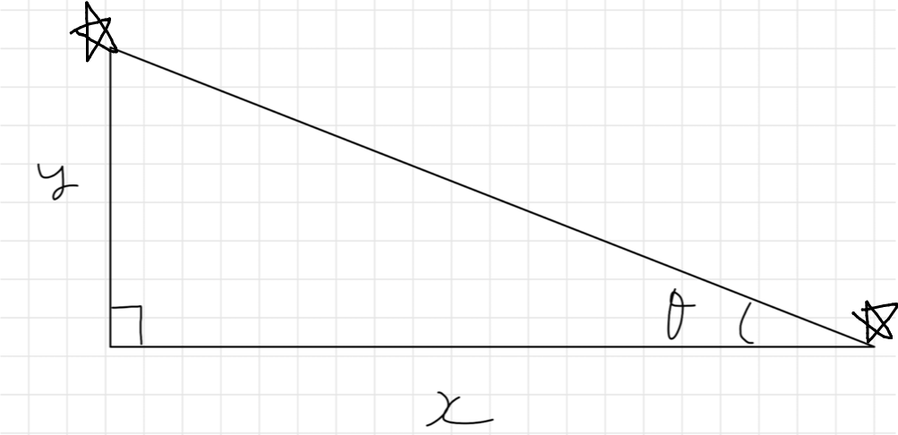
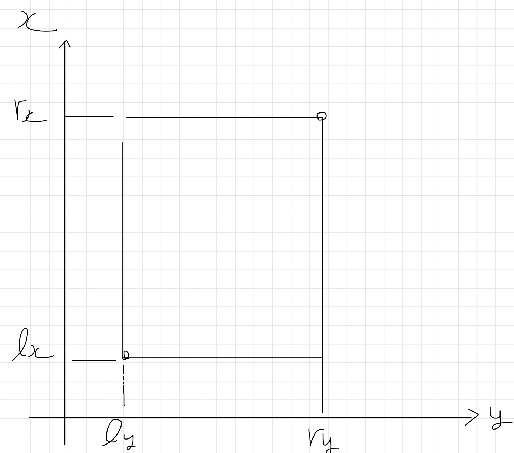
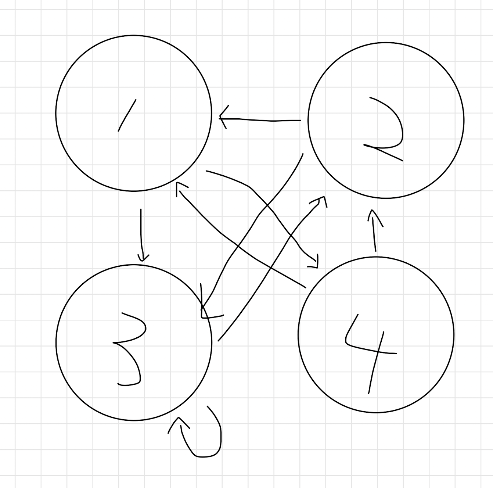
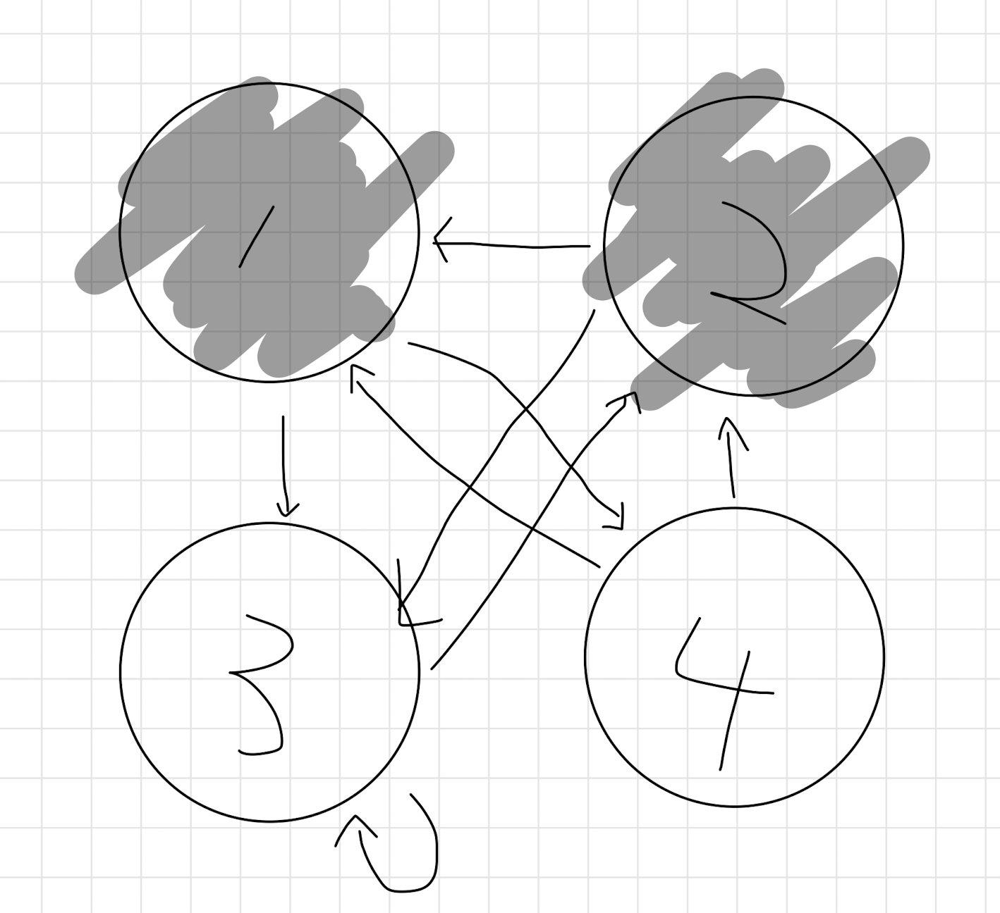
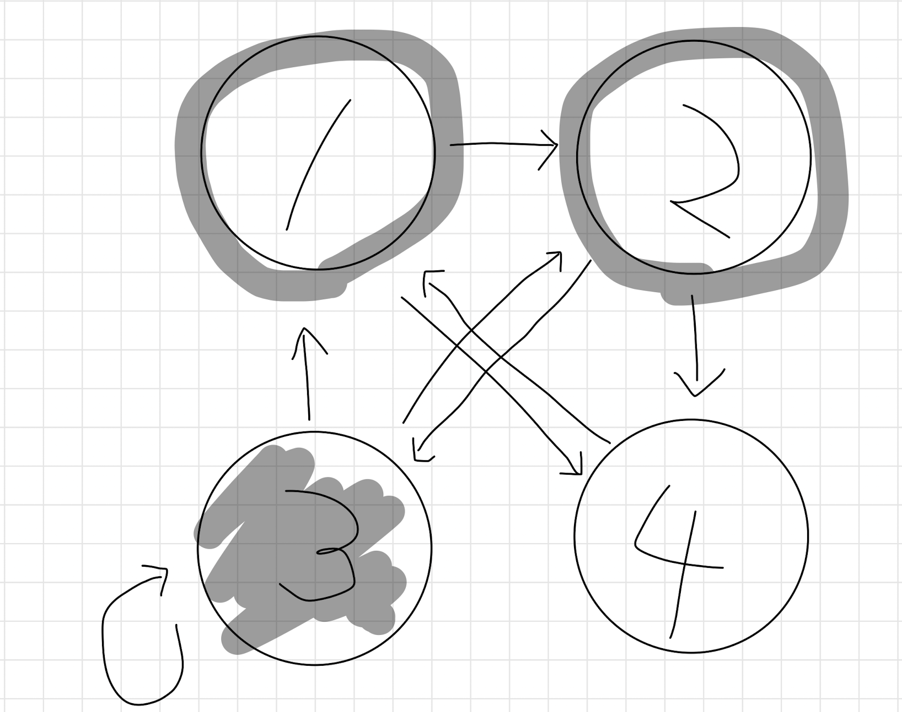

各問での新たな知見とキーワードをまとめる．

## review list

001, 009, 011, 015, 018, 019, 020, 021, 026, 028, 031, 045, 059, 066, 068, 072, 073
## skipped list

054, 074, 083, 005, 017, 023, 025, 040, 041, 071

## 001 - Yokan Party

- 初見では二分探索と気づかなかった
## 最大値の最小化，最小値の最大化は二分探索が有効

- 二分探索の関数`c(x)`の定義がかなり難しかった
  - $K+1$個にピースを分解することは必須条件
  - そのうち**最も短いもの**の長さを**最大化**したい
  - 関数「$K+1$個に分割する際に各ピースを$x$**cm 以上**にできるか」

## 002 - Encyclopedia of Parentheses

全探索

## 003 - Longest Circular Road

- 題意のグラフは木であり，2頂点の最遠距離を求めれば良い
- **木の直径**を求めるアルゴリズム
  - DFSを2回するだけ

## 004 - Cross Sum

- numpy遅い
- pypyじゃないと厳しそう

## 005 - Restricted Digits

- ただの桁DPではない
- 行列累乗への落とし込み

## 006 - Smallest Subsequence

## 辞書順は前から貪欲

- 自分より右に位置する各文字a, b, c, ...について最小のインデックスを前計算により求めておく

## 007 - CP Classes

- 二分探索

## 008 - AtCounter

- DP
- `'atcoder'`のように各文字が異なっていない場合はどう解けばよいのだろうか

## 009 - Three Point Angle

- 偏角ソート×二分探索
- 1点を決め打ち，その1点を原点とみたときの他の点との偏角を計算しソートする．各点と最も角度が大きくなるような点を二分探索により求める
  - 偏角は`atan(y, x) * 180 / π`で求まる
- かなり難しかった

## 010 - Score Sum Queries

- 累積和

## 011 - Gravy Jobs

## 仕事は締切の早い順に

- 小課題1
  - $N\le20$より$O(2^N)$で各仕事をする・しないの前列挙が可能
  - 整合性が保たれるか判定すればよい．その際，締切の早い順にソートしておくこと
- 小課題2
  - 締切を考慮すると，仕事時間の合計は高々最大の締切時間($O(maxD_i))$)に抑えられる．($max(C_i)\times N$とならないことに注意)
  - 見てきた仕事の数と合計仕事時間を添え字にするDP
- とりあえずスケジューリング問題は脳死で締切時間の早い順にソートしよう

## 012 - Red Painting

- DSU
- 2次元から1次元への変換関数を定義するのもありかも
  - `def ch(x, y): return x*W + y`

## 013 - Passing

## 重み付きグラフの場合はダイクストラ法

- BFSとベルマンフォード法を組み合わせたような実装をしてしまったがcppなら通る模様

## 014 - We Used to Sing a Song Together

- 貪欲法
- 証明を初めて見た

## 015 - Don't be too close

- 各$k=1,2,...,N$について，**ボールを取り出す個数を分けて考える**のがポイント
- $N$個のボールの中から差が$k$以上になるように$a$個取り出す方法は$_{n-(k-1)(a-1)}C_a$となる
この式は実際に手を動かしてみると分かる
階乗と階乗の逆元をを前計算により求めておくこと
$_nC_r=\frac{n!}{r!(n-r)!}$

## 016 - Minimum Coins

- 全探索

## 017 - Crossing Segments

- 円周上点を結んだ線分の交差点の数え上げ
- 交差条件は$L_s<L_t<R_s<R_t$か$L_t<Ls<R_t<Rs$

## 018 - Statue of Chokudai

- 仰角は次の図の角のこと．例の如く$ArcTan(y, x)$で求める
  - 返り値はラジアンのため，弧度法に直すなら$\times\frac{180}{\pi}$ をしよう

観覧車の位置を$\theta$で表現する方法が難しい

## 019 - Pick Two

- コストの小さいものから埋めていく貪欲法は不可．反例は？
- 「区間の除去」みたいな状況下では区間DPを疑おう．**列の操作は区間DP**
  - `()()`か`(())`に場合分けを行う
- https://algo-logic.info/range-dp/を 見ればなんとなく区間DPの雰囲気はつかめる
Pythonメモ化DPではTLEしました

## 020 - Log Inequality

- 対数の式変形．**整数で処理して誤差をなくそう**

## 021 - Come Back in One Piece

- 強連結成分分解
- グラフが連結と限らないことに注意（最初全ての頂点をDFSする必要がある）

## 022 - Cubic Cake

- 互除法
- 空で書きたい

## 023 Avoid War

- bitDPまでは解きたい

## 024 - Select +／- One

- 偶奇

## 025 - Digit Product Equation

- スキップ

## 026 - Independent Set on a Tree

**木は二部グラフ**である
二部グラフの性質
## 奇数長の閉路を含まない

## 最大マッチングの計算が多項式時間で可能

- 入出力例に難があり，他にも正解が存在することを記載すべき

## 027 - Sign Up Requests

- 集合

## 028 - Cluttered Paper

- 二次元いもす法
- 実際に紙に書くのがいい
- 
累積和のループ範囲でバグらせてしまった

## 029 - Long Bricks

- 遅延セグ木，座標圧縮
- なぜか座圧と遅延セグ木を同時に使うとTLE．なんで

## 030 - K Factors

- エラトステネスの篩

## 031 - VS AtCoder

## Grundy数を知っていますか

- Grundy数のxorが0であれば後手勝利，そうでなければ先手勝利である
- 慣れてないためGrundy数の計算に手間取った．タプルが整数0, 1, 2, ...に対応するのだが，そこはPythonに任せれば勝手に順番をつけてくれる
- 再帰のくせにPythonだと余裕で通らないので注意．ループ回数が多いためと思われる

## 032 - AtCoder Ekiden

- 順列列挙

## 033 - Not Too Bright

- 制約をよく確認しよう

## 034 - There are few types of elements

- 尺取り法

## 036 - Max Manhattan Distance

- マンハッタン距離は45度回転
- 45度回転により，ある点からのマンハッタン距離が最大となる点が長方形上に存在するようになる
- x最大，x最小，y最大，y最小となる点の4つを調べれば良い

## 037 - Don't Leave the Spice

- DPにセグメント木を利用するタイプ
- pypyでもTLE

## 038 - Large LCM

- pythonでは問題なし

## 039 - Tree Distance

主客転倒
愚直に計算するのではなく，その辺を利用するのはどの経路かを考える

## 042 - Multiple of 9

実際に各桁を考える（桁DPのようなことをする）必要はなく，桁和の値についてDPをする

## 043 - Maze Challenge with Lack of Sleep

- 各頂点へ**各方向を向いているという状態**を持たせることで解くことができる
  - 向きを変えた時に重みが増える
- PyPyじゃなぜか通らない

## 045 - Simple Grouping

- bitDP
- &と%を間違う痛恨のミス
- 部分集合の部分集合を列挙するプログラムを暗記しておきたい
- `for s in range(1 << n):`
- `    u = s`
- `    while u:`
- `        print(u)`
- `        u = (u - 1) & s`
- PyPyでは通せない
- C++のPythonでの演算子の順位の違いと，C++の桁溢れに苦しめられた

## 046 - I Love 46

- 46で割ったあまりで場合分け

## 048 - I will not drop out

- 部分点が満点ー部分点より大きいため取ることのできる点数を大きい方から取っていけばよい
- 上界を考える過程でこの解法が見えてくるとのこと

## 049 - Flip Digits 2

区間を反転させることが，「区間の左端の点とその一つ左の点，区間の右端の点とその一つ右の点の関係を変化させることができること」という言い換えをする
かつ各点間が（間接的にでも）関係を変化させ得るのなら，適切な順番によって色を一致させることが可能である
以上の考察で最小全域木の問題に帰着できる

## 050 - Stair Jump

- DP
- 1段 **か** L段なので注意

## 051 - Typical Shop

- 半分全列挙
- $N\le40$にピンとくるようにしたい

## 052 - Dice Product

- 式変形

## 055 - Select 5

- $_{100}C_{5}\le10^8$に気付けるかという問題
- `itertools`を使うとTLE

## 056 - Lucky Bag

- DPの復元

## 058 - Original Calculator

- functional graph

## 059 - Many Graph Queries

## ビット演算によるクエリ並列化

- グラフがDAGになっていること，トポロジカル順序が昇順であることを見抜く
- そのため複数のクエリを処理する上で，番号の小さい頂点から順に見ることにより他のクエリと被らずに済む

## 060 - Chimera

- LIS
- `dp[i] := 最後の値がa[i]であるようなLISの長さ`は普通に求めると$O(N^2)$であるが，$O(\log N)$である`dp[i] := 長さiのLISの最後の値`で求める際に，前者のDPの値を同時に計算可能

## 061 - Deck

- deque
- dequeと双方向連結リストは違うらしい...

## 062 - Paint All

ボールを頂点，アイテムを辺とみると見通しがよくなる
下は例題に関するグラフ
矢印の先が白ければ自分を黒く塗ることができる
- 順方向で操作を進めると，別の頂点の状態が変化する可能性がある
初期状態では4の頂点を黒に塗ることが可能
しかし頂点1と頂点2が塗られると，今後頂点4を塗ることは不可能

しかし，操作を逆方向から見ると，別の頂点の状態が変化することはなくなる
グラフの辺はすべて逆辺に．自己辺は無条件で黒く塗ることができ，黒い頂点に隣接している頂点も黒く塗ることが可能
頂点1と頂点2は今後好きなタイミングで塗ることができる

## 063 - Monochromatic Subgrid

- $H\le 8$よりなんかHを全探索する雰囲気
## 変な制約に着目する

- 使う行を決めたら，各列の値は一致する必要があることを利用

## 064 - Uplift

- 区間の両端のみが満足度に変化を与えることを考えれば，予め隣接二点間の距離の差（**絶対値ではない**）を保持しておき，区間の左端に対応するものは`v`を**加え**，右端に対応するものは`v`を**減じる**ことで状態を更新できる
- 遅延セグメント木で殴ることもできる

## 066 - Various Arrays

- いざ数列を作って考えるのではなく，数列の各部分$i$と$j$ $(i<j)$について 転置数が発生する期待値を求め足し合わせる
- **期待値の線形性**を利用する

## 067 - Base 8 to 9

- 基数変換 (10 -> 8)
- `divmod`を使うと簡単に書ける
  - `sna = []`
  - `while n:`
  - `    n, m = divmod(n, base)`
  - `    sna.append(str(m))`
  - `print(''.join(sna[::-1]))`

## 068 - Paired Information

## クエリ先読み

- 後ろの情報によって矛盾が生じることがないことから，その時点で`Ambiguous`か否かの判定ができれば，後ろの情報を用いてクエリに答えることが可能
- 各連結成分である値を+αした場合に，-αされる組と+αされる組に分かれることを利用し，$O(1)$で回答できる

## 069 - Colorful Blocks 2

- 左から順番に決めてやればいい
- $n=1$の場合に注意

## 070 - Plant Planning

## マンハッタン距離の最小化は中央値

  - 一つ右にずらした時，(自分より右側に存在する点の個数) - (自分より左側に存在する点の個数)だけマンハッタン距離の総和が変化する．よって中央値が最適となる

## 071 - Fuzzy Priority

- トポロジカルソート
- 複数の選択肢が出た場合に全探索するようにDFSを行うのが満点解法らしい

## 072 - Loop Railway Plan

バックトラック
  - 次行けるマスに対して再起呼び出し
  - 行き止まりに当たったか，次行ける全部の方向について調べ終わった場合行って戻る
- `visited[u] = True`
- `for v in graph[u]:`
- `   dfs(v)`
- `visited[u] = False`

## 073 - We Need Both a and b

- 木DP
- DPテーブルは納得
それぞれの子供に対して，辺をつなぐ／つながないの2通りの遷移が存在する

## 075 - Magic For Balls

- 整数$N$に対し素因数分解を行い，$d_1,d_2,...,d_k$と$k$個の素数に分解できたとする．整数$N$に対しどの順番で操作を行ったとしても，最終的に$d_1,d_2,...,d_k$が得られることを考えると，$d_1,d_2,...,d_k$は$N$を根とする木の葉に対応し，この問題はその木の高さを求める問題に帰着できる
- なおゴリゴリのDFSでもAC可能な模様

## 076 - Cake Cut

## 円環は2倍して列にする

- 尺取り法

## 078 - Easy Graph Problem

- Easy

## 079 - Two by Two

- 左上から順に操作を行う
- 蟻本の反転のやつ

## 080 - Let's Share Bit

- 包除原理
- 集合から選んだ要素数が奇数の場合は足して，偶数の場合は引く

## 081 - Friendly Group

- 2次元imos法
- 2次元プロット
- 差が$K$以下という条件を，`[x,x+k],[y,y+k]`の長方形領域を塗ることに対応させる

## 082 - Counting Numbers

- 各桁ごとに考える
- Pythonでは意識する必要はないが，C++だとオーバーフローに気を付ける
- 等差数列の和の公式
  - $1^2+2^2+3^2+\ldots +N^2=\frac{N(N+1)(N+2)}{6}$
  - $2^0+2^1+2^2+\ldots +2^{N-1}=2^N-1$
  - $p^0+p^1+p^2+\ldots=\frac{1}{1-p}\space(0<p<1)$

## 083 - Colorful Graph

- 実装がしんどいので後回し

## 084 - There are two types of characters

## 余事象を考える

- 累積的に直前の`o`,`x`の位置を考えても解けるとのこと

## 085 - Multiplication 085

- 約数の個数は少ない
